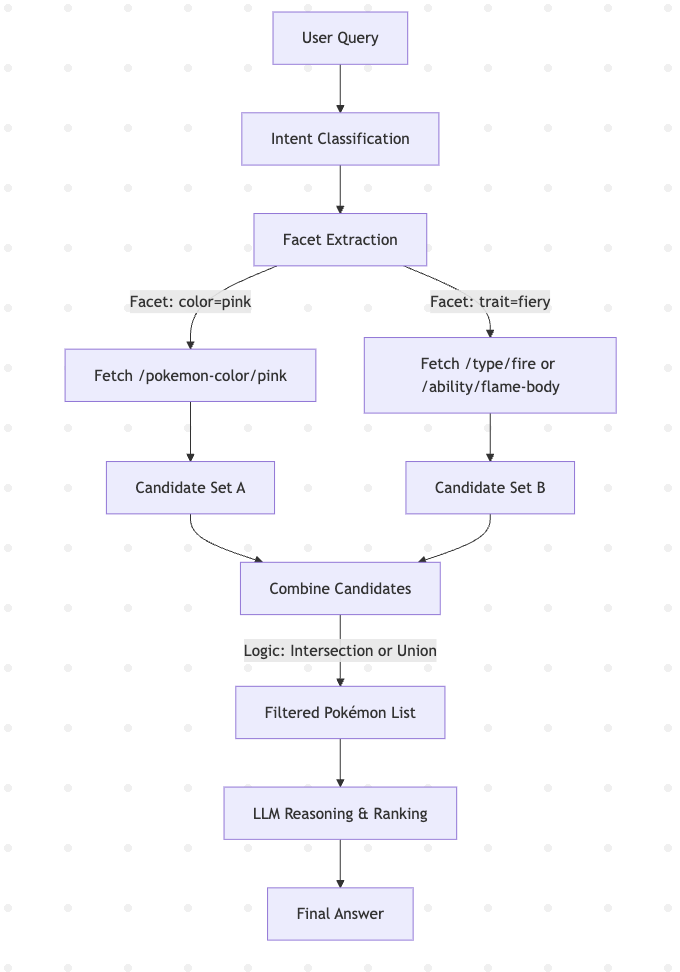

# Pokemon Deep Research Agent

A comprehensive Pokemon research system using intelligent query analysis, strategic API calls, and LLM-powered synthesis.

## 📜 System Design

The Pokémon Agent is designed to answer a wide range of Pokémon-related queries by combining LLM reasoning with selective API querying against the PokéAPI.
Instead of blindly retrieving all Pokémon data, the system applies a targeted retrieval strategy to minimize noise and improve answer quality.

### 1. Architecture Overview

### Key Steps

1. **User Query**  
   Example: `"pink fiery Pokémon"`  

2. **Intent Classification**  
   - Detects query type (e.g., team selection, single Pokémon info, comparison).  
   - Extracts facets from the query (e.g., `color=pink`, `trait=fiery`).  

3. **Facet → API Mapping**  
   - Maps each extracted facet to specific PokéAPI endpoints.  
     Example:  
       `color → /pokemon-color/pink`  
       `trait → /type/fire`  

4. **Targeted API Calls**  
   - Only queries the relevant endpoints instead of fetching all Pokémon.  
   - Parallel calls for each facet to reduce latency.  

5. **Candidate Merging**  
   - Combines API results based on logic:  
     **Intersection (AND)**: Pokémon must match all facets.  
     **Union (OR)**: Pokémon can match any facet.  
     Exclude flags applied at this stage.  

6. **Filtered Pokémon List**  
   - Deduplicated and cleaned candidate list.  

7. **LLM Reasoning**  
   - Ranks Pokémon based on additional context (e.g., “aggressive” → higher attack stat).  
   - Generates explanations and applies semantic filtering.  

8. **Final Answer**  
   Example: `"Magmar – pink and fiery with high attack power."`  

---

### Design Benefits
- **Efficiency**: Avoids brute-force scanning of all Pokémon.  
- **Modularity**: Intent classification and API mapping are independent.  
- **Deep Search Demonstration**: Combines multiple data sources before reasoning.  
- **Extensibility**: Easily add new facets (e.g., habitat, shape, generation).  

### 2. Flow Chart


### 3. Key Design Choices

- **Facet-based querying** ensures we fetch only relevant Pokémon, reducing API load and LLM context noise.
- **Flexible logic** allows different intents to use different combination strategies:
  - **Intersection** for strict filtering.
  - **Union** for broader recommendations.
- **Two-phase intelligence**:
  1. API pre-filtering to reduce irrelevant data.
  2. LLM post-processing for reasoning, ranking, and explanation.
- **Easily extensible**:
  - New facets (e.g., `egg_group`, `generation`) can be added with a single mapping update.
  - Intent–handler mapping allows new question types without major refactoring.

---

### 4. Example

**User Query:**  
> Find a strong yellow Dragon Pokémon without Flying type

**Pipeline:**
1. **Intent:** `trait_search`
2. **Facets:** `color = yellow`, `type = dragon`, `exclude_type = flying`
3. **API Calls:**
   - `/pokemon-color/yellow`
   - `/type/dragon`
4. **Logic:** Intersection → remove any with `type = flying`
5. **LLM Reasoning:** Rank by `base_attack` and return top candidates with descriptions.

---

### 5. Limitations & Future Improvements

- **Limited intent coverage**:  
  Currently supports a fixed set of intent classes (e.g., trait search, comparison, single Pokémon info).  
  → Future work: Expand to more complex questions (e.g., breeding compatibility, move set optimization, evolutionary path planning).

- **Dependency on PokéAPI structure**:  
  Changes in PokéAPI endpoints or data schema could break the mapping logic.  
  → Future work: Add schema auto-discovery and fallback strategies and add other data sources.


- **No cross-endpoint optimization**:  
  At present, merging results from multiple endpoints uses basic intersection/union logic.  
  → Future work: Add weighted scoring and probabilistic merging for more nuanced results.

- **LLM context noise handling**:  
  While API pre-filtering reduces noise, some irrelevant attributes still enter the LLM context.  
  → Future work: Add content ranking before sending to LLM, or use vector similarity filtering.

- **Single-turn conversation**:  
  No memory of previous queries in the current implementation.  
  → Future work: Enable multi-turn context tracking for follow-up questions.

---


## Quick Start

### 1. Installation

```bash
# Clone or download the project
pwd
cd pokemon-llm-ai-agent

# Install dependencies
pip install -r requirements.txt
```

### 2. Environment Setup

The project uses a `.env` file for configuration. A template is provided as `env_example.sh`.

```bash
# Copy the environment template
cp env_example.sh .env

# Edit the .env file with your settings
# The file should contain:
# OPENAI_API_KEY=your-openai-api-key-here
# LOG_LEVEL=INFO
```

**Important**: Replace the placeholder API key in the `.env` file with your actual OpenAI API key.

### 3. Running the System

#### Interactive Mode (main.py)
Run the interactive version that takes keyboard input:

```bash
python main.py
```

The system will prompt you to enter a Pokemon query and conduct deep research.

#### Test Mode (test_main.py)
Run the test version with predefined queries:

```bash
python test_main.py
```

This will test the system with a predefined query to verify everything works. You can add your own questions.

## Example Queries

- "Build a team of all bug type Pokemon"
- "Find me some mythical Pokemon but not Mew or Mewtwo"
- "What are some cool water Pokemon that aren't too popular?"
- "I want a pink fairy pokemon"
- "Do Pokemon like berries?"
- "Is there any winged fiery dragon?"
- "What is Pokemon, why do people like them and what can they do?"

## System Components

- **LLMQueryAnalyzer**: Intent classification & entity extraction
- **IntentEndpointMapper**: Strategic endpoint selection
- **ExclusionHandler**: Multi-layer exclusion processing
- **FallbackQueryProcessor**: Edge case handling
- **DeepResearchAgent**: Complete orchestration
- **AdvancedReportVisualizer**: Comprehensive reporting

## Output

The system generates:
- Comprehensive research reports (saved as text files)
- Raw research data (saved as JSON files)
- Comparison with simple LLM responses

All reports are saved in the `reports/` directory with timestamps.

## Configuration

### Environment Variables (.env file)

```bash
# OpenAI API Configuration
OPENAI_API_KEY=your-openai-api-key-here

# Logging (DEBUG, INFO, WARNING, ERROR)
LOG_LEVEL=DEBUG
```

### Log Levels
- `DEBUG`: Detailed logging for development
- `INFO`: Standard logging (default)
- `WARNING`: Only warnings and errors
- `ERROR`: Only error messages

## Requirements

- Python 3.10+
- OpenAI API key
- Internet connection for Pokemon API access

## Troubleshooting

### Common Issues

1. **"OPENAI_API_KEY not found"**
   - Check that your `.env` file exists and contains the API key
   - Ensure the API key is valid and has sufficient credits

2. **"Module not found" errors**
   - Run `pip install -r requirements.txt` to install dependencies

3. **Network errors**
   - Check your internet connection
   - The system requires access to both OpenAI API and Pokemon API

4. **Rate limiting**
   - The system includes built-in rate limiting for API calls
   - If you encounter rate limits, wait a few minutes and try again

## Project Structure

```
claude_pokemon_agent/
├── main.py              # Interactive version (keyboard input)
├── test_main.py         # Test version (predefined queries)
├── .env                 # Environment configuration (create from env_example.sh)
├── requirements.txt     # Python dependencies
├── README.md           # This documentation
├── core/               # Data models
├── api/                # API clients and token management
├── analysis/           # Query analysis and intent mapping
├── processing/         # Query processing and fallback handling
├── research/           # Main orchestration logic
├── reporting/          # Report generation and visualization
└── reports/            # Generated reports (created automatically)
```

## Advanced Usage

### Report Location
Reports are automatically saved in the `reports/` directory with timestamps:
- `pokemon_research_YYYYMMDD_HHMMSS.txt` - Human-readable report
- `research_data_YYYYMMDD_HHMMSS.json` - Raw data in JSON format

### API Key Security
- Never commit your `.env` file to version control
- The `.env` file is already in `.gitignore` to prevent accidental commits
- Use environment variables in production environments